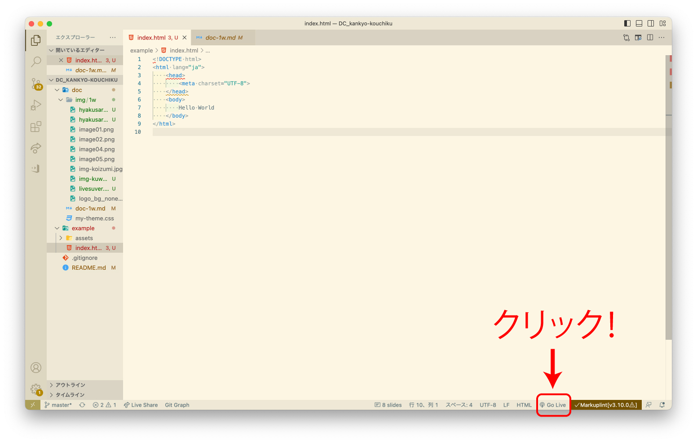

# コーディング<br>ライブ授業
<h2 class="firstPage">「環境構築」</h2>


---

1. 自己紹介
1. コーディングって
1. 準備
1. Visual Studio Code
1. 環境構築

---

## 自己紹介

--

### 桑原杏咲 
-
<div style="text-align:left">
女子美術大学で油絵を勉強、<br>卒業後は大学院へ進学し修了。<br>
2022年にデザインキャンパス卒業後、株式会社IMAKEに入社。
趣味でイラストを描きつつ、実務ではweb、印刷物など幅広いデザインに携わってます。
</div>

<div>

</div>

--

ポートフォリオサイト<br>

https://kuwage.site/

---

## コーディングって？

--

<div class="separateBox">
    <div class="separateBox-txt"><em>デザイン</em><br>洋服で言うなら型紙、設計図</div>
    <div class="separateBox-img"></div>
</div>

--

<div class="separateBox">
    <div class="separateBox-txt"><em>コーディング</em><br>縫製して製品にする部分</div>
    <div class="separateBox-img"></div>
</div>

--

## 準備

--

### ファイルを用意しよう

--

```
root(任意の名称のフォルダ)
├ assets：HTML以外の様々なファイルを格納
│ ├ css：CSSを格納
│ ├ images：画像ファイルを格納
│ └ js：JavaScriptを格納
│
├ index.html
```

---

## Visual Studio Code

--

### Visual Studio Codeとは

--

- Microsoftが開発する、オープンソースのコードエディタ
- HTML、CSS、JavaScriptはもちろん、様々な言語に対応
- 実はそれ自体がJavaScriptなどのフロントエンドの技術できている

--

### インストール

--

は、終わっているはず

--

終わってなかったら、授業受けながらしてね。  
プラグインもね

--

では、ちょっと触ってみましょう

--

用意しておいたフォルダを、VSCodeにドラッグ＆ドロップ！

--

imdex.htmlを開いて、「!」を入力してenter<br>
すると以下のように記載されると思います

```HTML

<!DOCTYPE html>
<html lang="ja"> <!--ここがjaじゃない人は教えてください-->
    <head>
        <meta charset="UTF-8">
        <meta http-equiv="X-UA-Compatible" content="IE=edge">
        <meta name="viewport" content="width=device-width, initial-scale=1.0">
        <title>Document</title>
    </head>
    <body></body>
</html>


```

--

今回は以下の記述が不要なので、消去します。

```HTML
 <meta http-equiv="X-UA-Compatible" content="IE=edge">
        <meta name="viewport" content="width=device-width, initial-scale=1.0">
        <title>Document</title>
```

--

こうなりましたか？
```HTML

<!DOCTYPE html>
<html lang="ja">
<head>
	<meta charset="UTF-8">
</head>
<body>
	
</body>
</html>

```

--

bodyタグの中に、Hello Worldと書いてみましょう
```HTML

<!DOCTYPE html>
<html lang="ja">
<head>
	<meta charset="UTF-8">
</head>
<body>
	Hello World
</body>
</html>

```

---

## 本日のメインイベント

---

## LiveServerプラグイン

--

インストールもうしたよ〜という方
<!-- 全員インストールしてたら、インストールのくだりをスキップ -->

--

1. 左側メニューのアイコン【拡張機能】をクリック
1. テキストボックスにLive serverと打ち込む
1. Live Serverの位置にあるinstallをクリック


---

## LiveServerプラグインとは

--

開発にはWebサーバーがあると便利

--

レンタルサーバーなどにあげながらの開発は現実的ではない

--

パスの利用も変わってくる

--

- "./assets/images/demo.png"
- "https://www.sample.com/assets/images/demo.png"
- "/assets/images/demo.png"

--

とはいえ、いきなりサーバーを建てるのは厳しい

--

LiveServerプラグインがあれば大丈夫！  
しかも自動でリロードなんかもしてくれる

--

LiveServerを使ってみよう

--

1. さっきつくった「index.html」をvscodeで開く
1. 画面下部、「Go Live」をクリック



--

<div style="text-align:left">
ブラウザで表示されます<br>
ファイルを編集すると、ブラウザ更新しなくても、自動で反映してくれます

</div>

--

### その他のプラグイン

--

****zenkaku****

[https://marketplace.visualstudio.com/items?itemName=mosapride.zenkaku](https://marketplace.visualstudio.com/items?itemName=mosapride.zenkaku)

****Auto Rename Tag****

[https://marketplace.visualstudio.com/items?itemName=formulahendry.auto-rename-tag](https://marketplace.visualstudio.com/items?itemName=formulahendry.auto-rename-tag)

****Image preview****

[https://marketplace.visualstudio.com/items?itemName=kisstkondoros.vscode-gutter-preview](https://marketplace.visualstudio.com/items?itemName=kisstkondoros.vscode-gutter-preview)

---

おわり
--