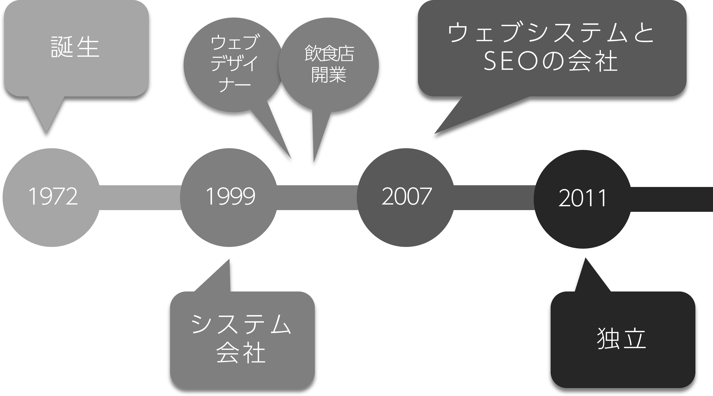
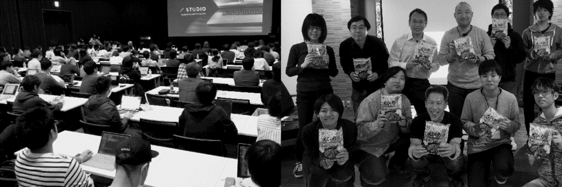
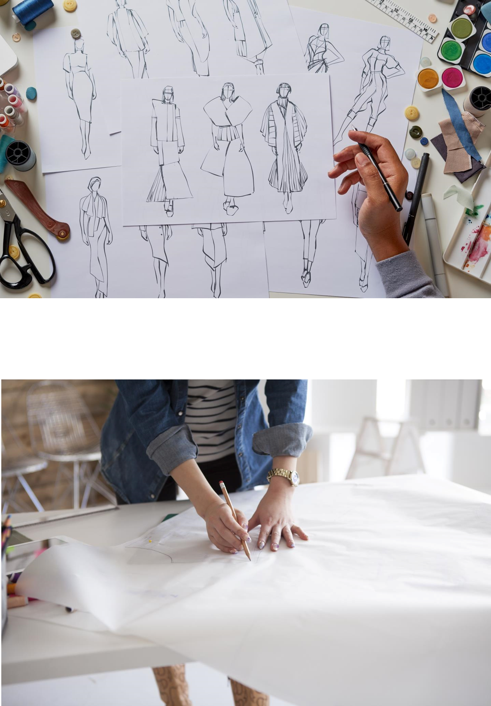
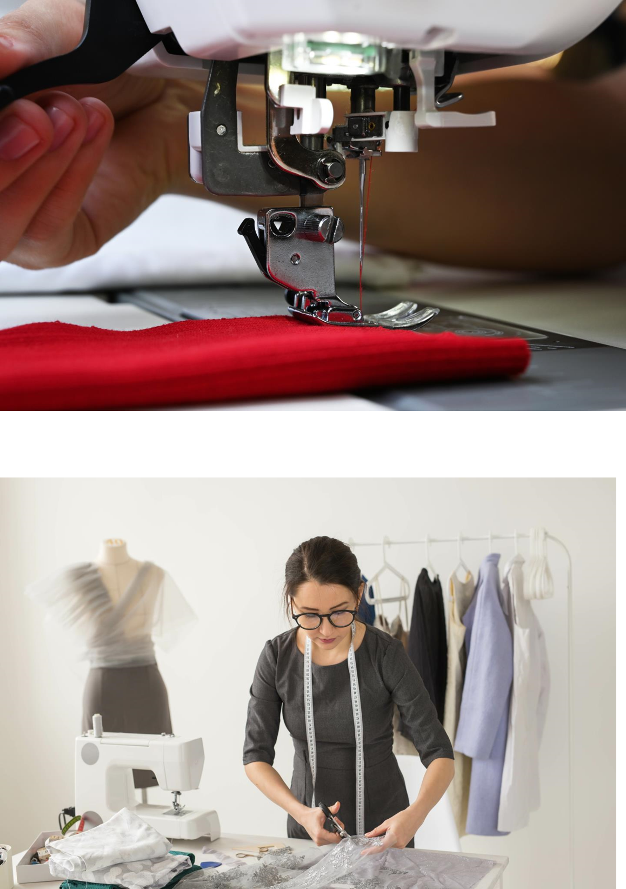
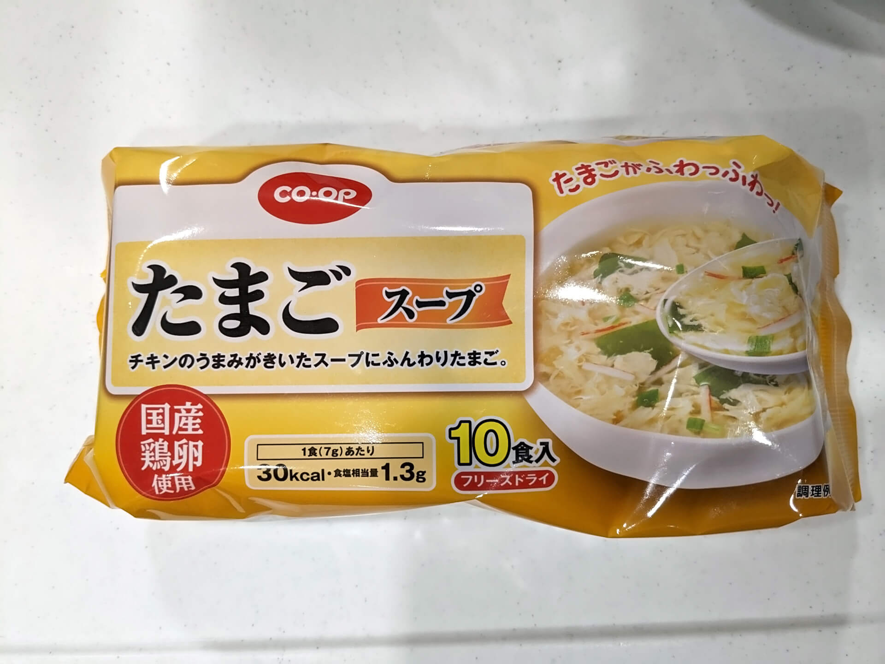
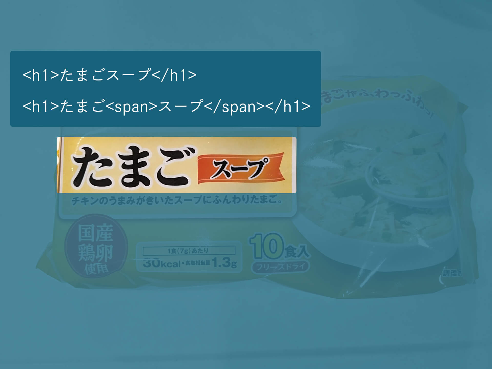
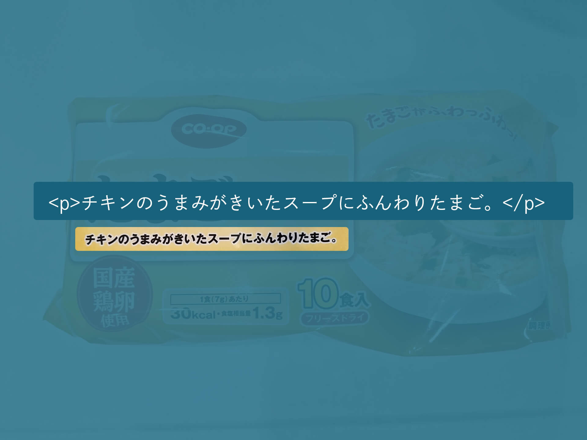
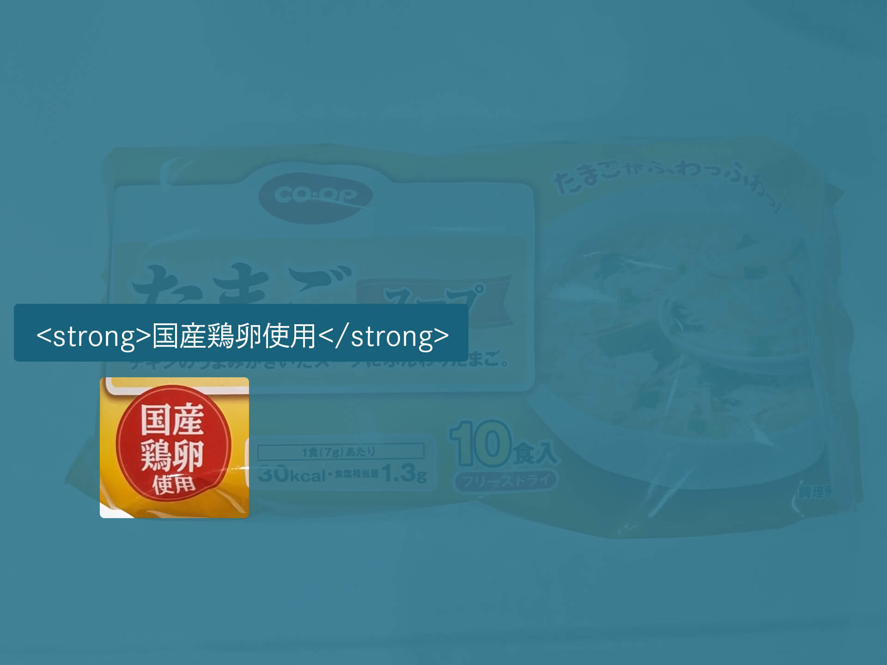
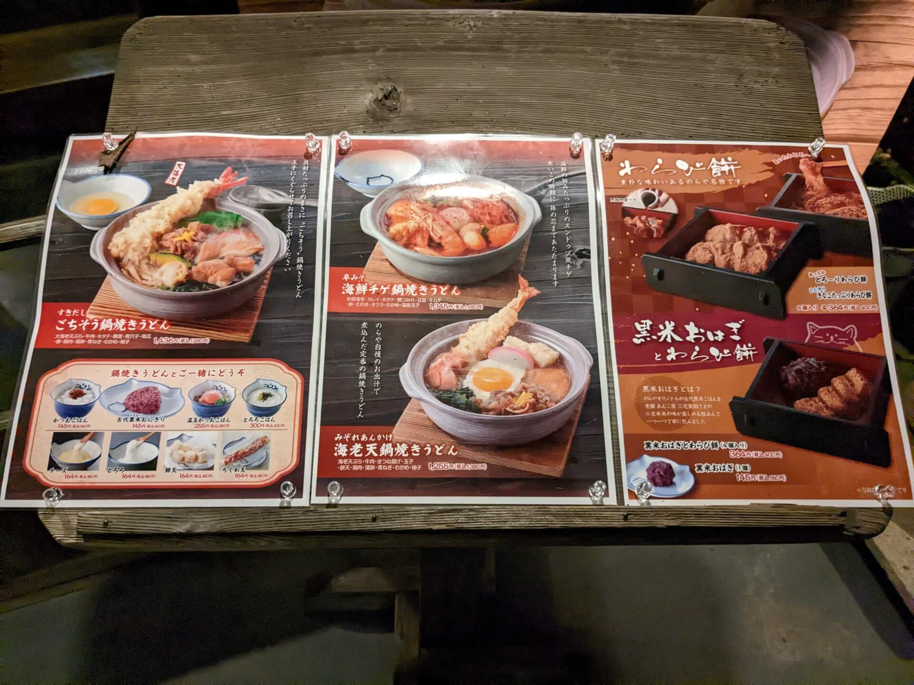

# コーディング基礎<br>ライブ授業
<h2 class="firstPage">1週目「HTML」</h2>


---

1. 自己紹介
1. コーディングとは
1. HTMLとは
1. よく使うタグ
1. いろんなものをマークアップ
1. タグを掘り下げる
1. 実習：ネームカードを作ろう
1. 次回に向けて

---

## 講師の自己紹介

--

### 小泉 誠 
- Webデザイナー・UI/UXデザイナー
- フロントエンドエンジニア
- Web運用や集客のコンサル
- DXサポート
- 教育事業
<div></div>
<div>

--

<div style="text-align:left">
「Studio FireColor」という屋号で、フリーランスとして活動中。ウェブ制作会社、システム会社、SEO系の会社などで10年 以上の経験をつみ独⽴。<br>
独⽴から10年⽬（2021年現在）
</div>

<div style="margin-top: 2.4rem; text-align:left">
Webデザイナーに始まりフロントエンド全般、SEO、 マーケティング、システム開発、集客や社内のIT化のコンサルティングなど。<br>
現在は「本⼈も職種がわからない…」といった感じで、 ゼネラリスト道を邁進中。
</div>

--

- 代理店経由で大手企業の仕事が5割
- 元請で中小企業中心に5割

--



--

### activities
IT分野での活動

--

  

- Web系の勉強会の主宰やスタッフ
- Web技術の講師
- 高校教員の情報技術研修
- 子供向けプログラミング教育ボランティア

---

## コーディングとは

--

<div class="separateBox">
    <div class="separateBox-txt"><em>デザイン</em><br>洋服で言うなら型紙、設計図</div>
    <div class="separateBox-img"></div>
</div>

--

<div class="separateBox">
    <div class="separateBox-txt"><em>コーディング</em><br>縫製して製品にする部分</div>
    <div class="separateBox-img"></div>
</div>

--

### 心がまえ

--

- 全てのコードには意味があることを意識する
- カンプや仕様書を見て作業前にHTML、CSSを想像する（JSもね）
- 動作の確認・デバッグは怠らない
- 技術に関して、基本的にわからないことはググる、自分で調べる

--

### 参考にしてほしいサイト

--

Can I use  
[https://caniuse.com/](https://caniuse.com/)

MDN  
[https://developer.mozilla.org/ja/docs/Web](https://developer.mozilla.org/ja/docs/Web)

---

## HTMLとは

--

### HTMLってなんだっけ？

--

Hyper Text Markup Language

--

- HyperText：すごいテキスト、テキストを超えたテキスト
- Markup ：文章の意味を明確にするために印をつける
- Language：言語

--

HTMLはセマンティックを心がける

--

より正確に意味を持たせること

--

セマンティックなHTMLはデザインやコミュニケーションにつながる

--

### デザインの4原則

--

- 近接
- 整列
- 強調
- 反復

--

- 近接：グループ化、関連する情報をまとめる
- 整列：要素をそろえる
- 強調：要素に優先度をつけてる
- 反復：繰り返すことで統一感を持たせる

--

```HTML
<ul class="cards">
    <li class="card"><h2>キャベツ</h2><p>春が旬の野菜</p></li>
    <li class="card"><h2>白菜</h2><p>冬が旬の野菜</p></li>
    <li class="card"><h2>きゅうり</h2><p>夏が旬の野菜</p></li>
</ul>
<ul class="cards">
    <li class="card"><h2>鶏肉</h2><p>ニワトリの食肉</p></li>
    <li class="card"><h2>牛肉</h2><p>牛の食肉</p></li>
    <li class="card"><h2>豚肉</h2><p>豚の食肉</p></li>
</ul>
```

--

- 正確な意味をもたせることができると、画面デザインするうえでも考えやすくなる
- 内容を整理できるようになれば、自分の理解も深まり、人にも伝えやすい

---

## よく使うタグ

--

### <small>最低限知っていれば文書構造がつくれる</small>
- h
- p
- a
- img
- br

--

### <small>文章のグルーピングやレイアウト作成のために</small>
- div
- span

--

### <small>より分かりやすい文書構造のために</small>
- ul
- ol
- table

--

### <small>知っておきたい要素</small>
- nav
- header
- main
- footer
- article
- section
- aside

---

## いろんなものをマークアップ

--



--



--



--



--


--

```html
<hgroup>
    <p>CO-OP</p>
    <h1>たまごスープ</h1>
    <p>チキンのうまみがきいたスープにふんわりたまご。</p>
</hgroup>
<strong>国産鶏卵使用</strong>
<section>
    <h2>1食<small>(7g)</small>あたり</h2>
    <ul>
        <li>30Kcal</li>
        <li>食塩相当量1.3g</li>
    </ul>
</section>
<p>10食入り<small>フリーズドライ</small></p>
```

--

### みんなもやってみよう

--



---

## タグの掘り下げ

--

### imgタグを掘り下げます

--

Webサイトの大半は、テキストと画像

--

画像のほうがデータ量が大きい  
↓  
画像が適切に使えると快適になる

--

- ユーザーの興味を引き、理解度を深める
- 実はSEOにも効果がある

--

#### サンプルコード

/example/img_tag.html

--

### おまけ

--

- detailsタグ
- summaryタグ
- dialogタグ

---

## 実習：ネームカードを作ろう

--

簡単なネームカードをHTMLで作成します。  
CSSの講義は来週ですが、基本的なことで対応できると思うのでそこまで進めていただけたらと思います。

HTMLもCSSもindex.htmlに記載してください、

--

<span style="font-size: 1.6em;">11:45 まで</span>

--

### LINT

構文チェックをしよう

#### W3C Markup Validation Service
https://validator.w3.org/


---

## 来週に向けて

--

### 課題

--

#### ネームカードを完成させてください  
<small>課題は実習でやるネームカードを完成させることになります。  
提出はファイル一式をzipに圧縮して提出してください</small>

<small>期限は6月1日 23：59</small>

<small>🔥 Firefox八王子のサイトも進めてね 🦊</small>


--


### 予告

CSSだよ


