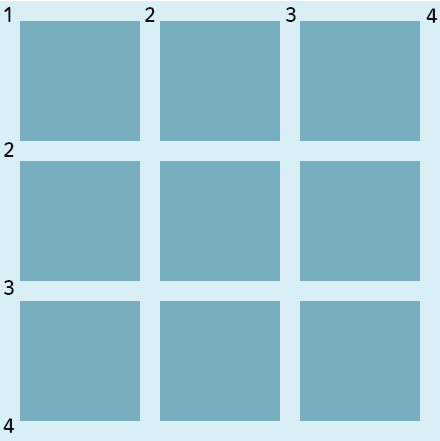
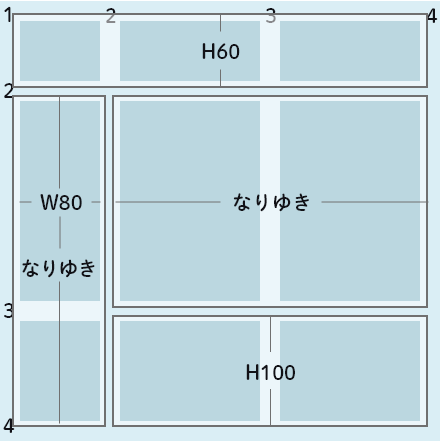
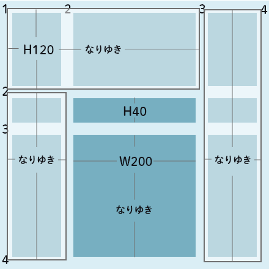

# コーディング基礎 ライブ授業
<h2 class="firstPage">2週目「CSS」</h2>

---

1. 先週の課題
1. アイスブレイク
1. CSSの基礎を復習
1. レイアウト手法
1. 便利なCSSやTips
1. 実習：カードコンポーネントを作ろう
1. 次回に向けて

---

## 先週の課題

---

## アイスブレイク

--

### 目玉焼きを焼こう

--

- 新しいHTMLファイルを作って
- 使っていいHTMLの要素は**3つまで**
- CSSはHTMLファイルに直書き
- 美味しそうになるように ← これ大事

10:20 まで

---

## CSSの基礎を復習

--

### セレクタ

--

CSS selectors cheatsheet &amp; details - Nana Jeo  
https://nanajeon.com/css-selectors-cheatsheet-details/

エンジニアのためのWebチートシート  
https://web-cheatsheet.com/css-selector

--

### 詳細度

--

CSSが適用される優先順位

* 登場する順番が新しいほうが強い
* 詳細度が高いほうが強い

--

1. style属性
1. id属性
1. class属性やその他の属性セレクタ
1. 要素・疑似要素

--

例外

* !important
* 全称セレクタ（*）

--

### 疑似要素・疑似クラス

--

**疑似要素**
- ::before
- ::frist-letter

--

**疑似クラス**
- :hover
- :frist-child
- :not

--

etc...

---

### 様々な単位

--

- 絶対的な単位  
px、pt、mm … etc
- 相対的な単位  
%、em、rem、vw … etc

※できるだけ使用する単位は少なく

---

## レイアウト手法

--

レイアウトを組むのによく使われるプロパティは？

--

- display: flex;
- float
- position
- display: grid;

--

- display: flex;　小さな単位
- float　文字の回り込む
- position　絶対的な位置指定
- display: grid;　大きな単位

<small>※作るものにもよる点は注意</small>
<small>※例：上下左右中央寄せを簡単にする場合にgridを使うことがある</small>

--

### CSS Gridを使ってみる

--

  

参考コード： /example/css-grid-1.html
--

  

参考コード： /example/css-grid-2.html

--

  

参考コード： /example/css-grid-3.html

---

## 便利なCSSやTips

--

参考コード： /example/css-tips.html

---

## 実習：カードコンポーネントを作ろう

--

カードコンポーネントをHTMLで作成します。  
コンポーネントという考えを意識して作成してください。

HTMLは新たにcards.htmlというHTMLを作成して記載してください。

--

11:45 まで

---

## 来週に向けて

--

### 課題

--

#### カードコンポーネントを完成させてください  
<small>提出はファイル一式をzipに圧縮して提出してください</small>

<small>期限は6月8日 23：59</small>

<small>🔥 Firefox八王子のサイトも進めてね 🦊</small>

--

### 予告

JavaScriptだよ

