#ライブ授業
<h2 class="firstPage">「Webサイトの運用について」</h2>


---

1. Webサイトは作ってからが本番
1. Webにおける、ユーザーとチャネルの変化
1. Webサイトを使った集客で今後大事になること
1. 現状を把握するために
1. SEO
1. コンテンツマーケティング
1. 来週に向けて

---

## Webサイトは作ってからが本番

--

### Webサイトの種類

--

- 静的サイト  
HTML等で直接制作
- 動的サイト  
CMSなどで管理するものやプログラムを自作

--

### 別の視点で見ると

--

- ただの名刺的なサイト
- Webサイトから何らかの利益を出すのが目的

--

### Webサイトを有益にするために考えるべきこと

--

- 訪れた人に好きになってもらう
- 沢山の人に訪れてもらう

--

ローンチ、その後は

--

**目標を達成しているかを解析**
<div class="t-l">
<p>Yes → より高い目標へ</p>
<p>No → どうすれば目標を達成できるか</p>
</div>

--

#### 名刺的なサイトが悪いわけではない
<div class="box box-sup">
<ul>
<li>屋号付きの口座作るのに必要だった</li>
<li>融資審査などでみられる</li>
</ul>
</div>

---

## Webにおける、ユーザーとチャネルの変化

--

### ユーザーの変化

--

ユーザーの行動・思考パターンはこの数年で大きく変化した

--

- 皆と同じから個人個人への細分化
- 大きな権威よりも共感できる人の意見に寄り添う
- 他よりも己。最短手段と自己利益を優先する傾向

--

#### ユーザーの近年の思考
- 「できるだけ簡単に有益な情報を手に入れたい」
- 「共感出来て信頼できる人の言っていることがいい」
- 「でも、押しつけられるのは嫌」

--

<div class="box">
なんとなく欲しい→検索→なんかよさそう→購買
</div>

<div class="box">
○○が欲しい→詳しく調べる→自分に有益そう→購買
</div>

--

### チャネルの変化

--

検索は使われなくなっている、は本当か

--

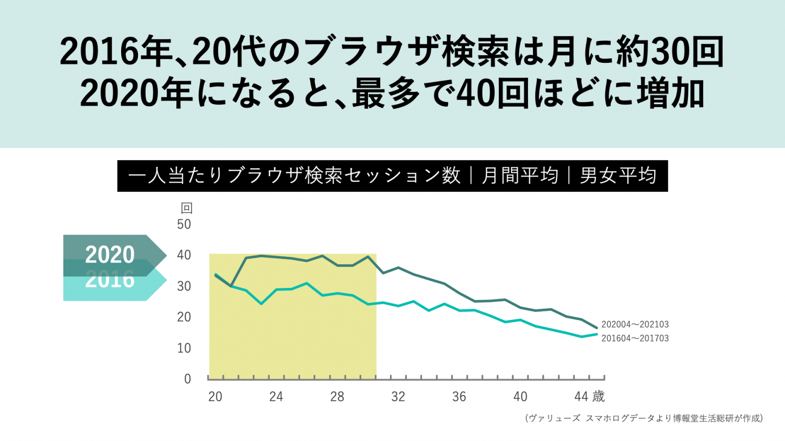

--

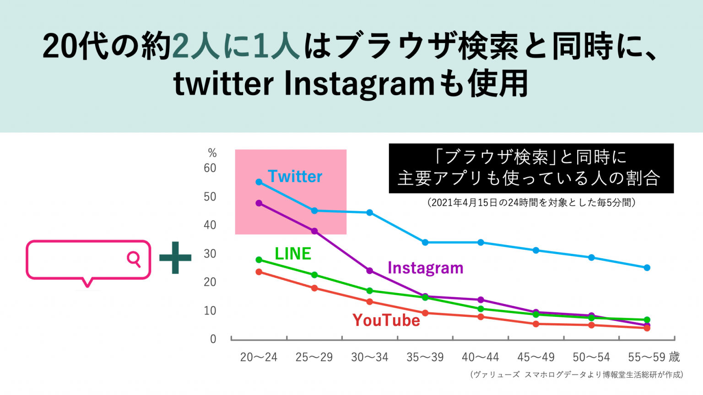

--

SNSも使うけどブラウザ検索もしている、ということが見えてくる

--

<div class="box">
✖チャネルが変化している<br>
〇チャネルが多様化している
</div>

--

### WebサイトをSNSの役割

--

#### SNS

- ブランド認知度の向上
- コミュニケーション
- エンゲージメントの向上

--

#### Webサイト

- 詳細な情報の提供
- 信頼性の向上
- コンバージョンの向上

---

## Webサイトを使った集客で今後大事になること

--

### Webサイトの意義

--

もっと好きになってもらうこと  
（実はSEOにも関連してきます）

--

### 大事にするべき5つのこと

--

1. 訪れた人の気持ちを考える（ユーザーエクスペリエンス）
1. コンテンツマーケティング
1. スマートフォンなどへの最適化（モバイルフレンドリー）
1. SEO
1. SNS

---

## 現状を把握するために

--

- Google Analytics
- Google Search Console
<div><small>↓</small></div>
<div style="margin-bottom: 1.6em;"><small>Webサイトの現在の状態を把握する</small></div>

- Microsoft Clarity
<div><small>↓</small></div>
<div><small>訪れたユーザーの行動を視覚化できる</small></div>

--

### Google Analytics
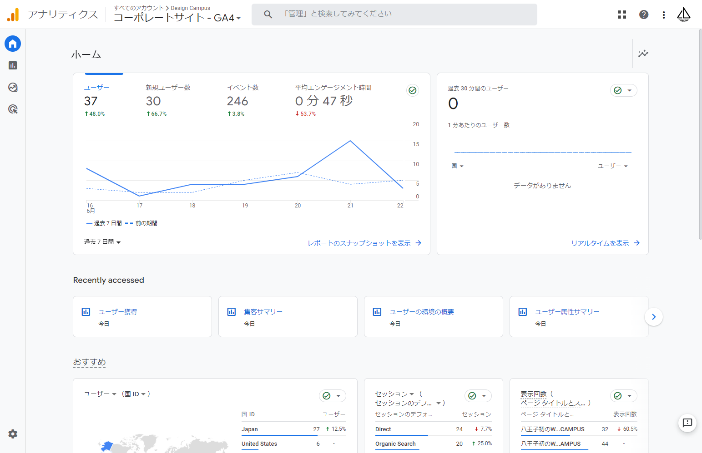
--

- UA (Universal Analytics)
- GA4(Google Analytics 4)

--

GA4の画面を見てみよう

--

#### 最低限見ておきたい項目

- ユーザー属性の概要
- テクノロジーの概要でモバイルとデスクトップの比較
- 集客の概要でどこから流入があるか
- エンゲージメント＞ページとスクリーン
- エンゲージメント＞ランディングページ

--

#### 期間設定を忘れずに

デフォルトでは2ヶ月なので、最大の14ヶ月に

「管理」＞「データ設定」＞「データ保持」

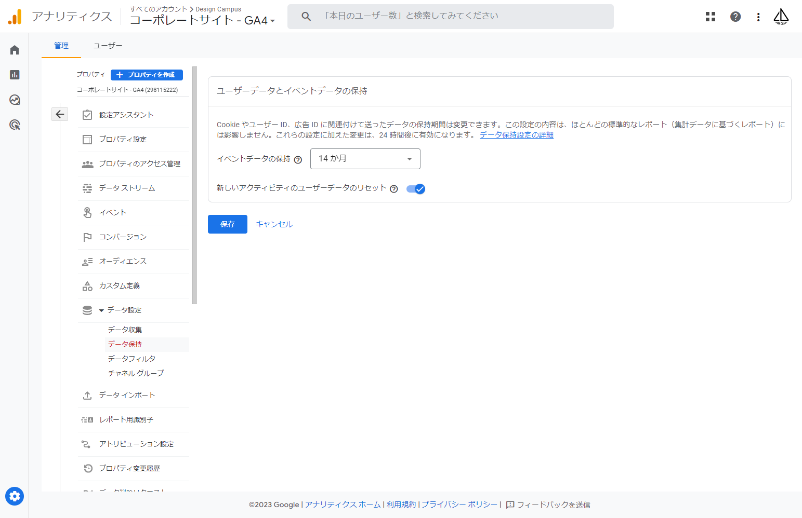

--

### Google Search Console

--

今回は画面を見るだけで

--

### Microsoft Clarity
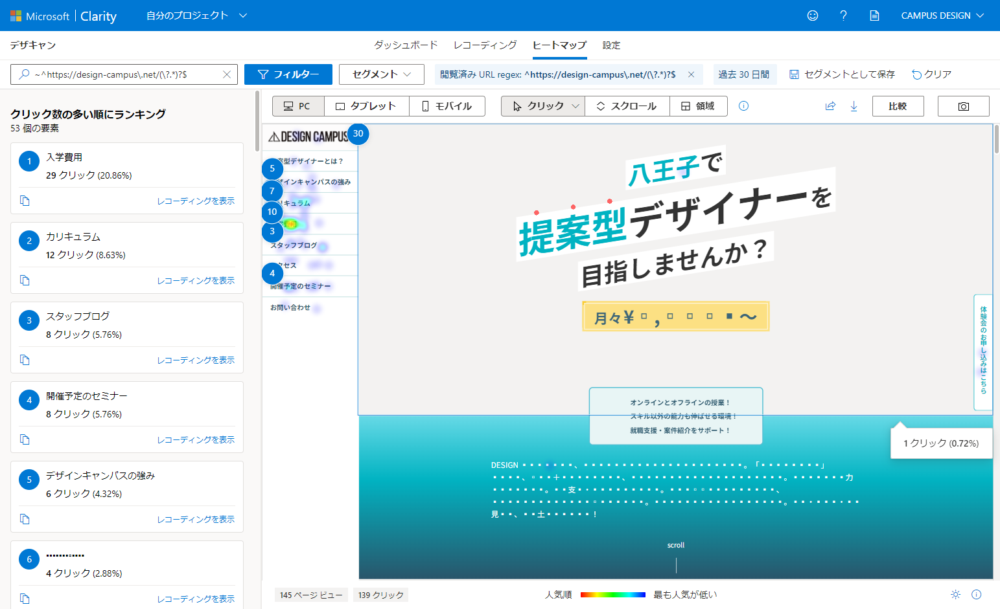

--

Clarityも実際の画面で

---

## SEO

--

Search Engine Optimization

検索エンジンで上位に表示されるようにすること

--

上位表示：あるキーワードで検索した時の検索順位

--

キーワードが重要

--

### KWについて知る

--

ユーザーはどんな言葉で検索して訪れるのか？

--

**目的や商売の特色から考えていくのが基本**

- ラーメン屋さんであれば、ラーメン
- Webデザインスクールであれば、WebデザインスクールやWebデザイナー

--

- 八王子にあるラーメン屋なんだから、「八王子 ラーメン」
- 特色を加えて「実戦的 Webデザインスクール」

--

こんなKWで検索して来てくれた人は利益に繋がりやすい、を考える

--

- ビッグキーワード
- ロングテールキーワード(スモールキーワード)

--

### KWを探す

--

#### 便利なサービス
[ラッコキーワード](https://related-keywords.com/)
<div class="box">
<small>
サジェストなどからKWを集めて表示してくれる。<br>
実際にその言葉で多く検索されているものから検索エンジンが候補を出してくれるので、世の中で必要とされている言葉の確率が高くなります。
</small>
</div>

--

他にも、Googleトレンドや、Twitteの情報なども参考になります。

--

### そのKW、検索されてます？

--

**検索ボリュームを調べる**

[Googleキーワードプランナー](https://ads.google.com/intl/ja_jp/home/tools/keyword-planner/)

<div class="box">
<small>
Google広告に含まれるツールの1つ<br>
広告を出稿しなくても単体・無料で使用可能
</small>
</div>

--

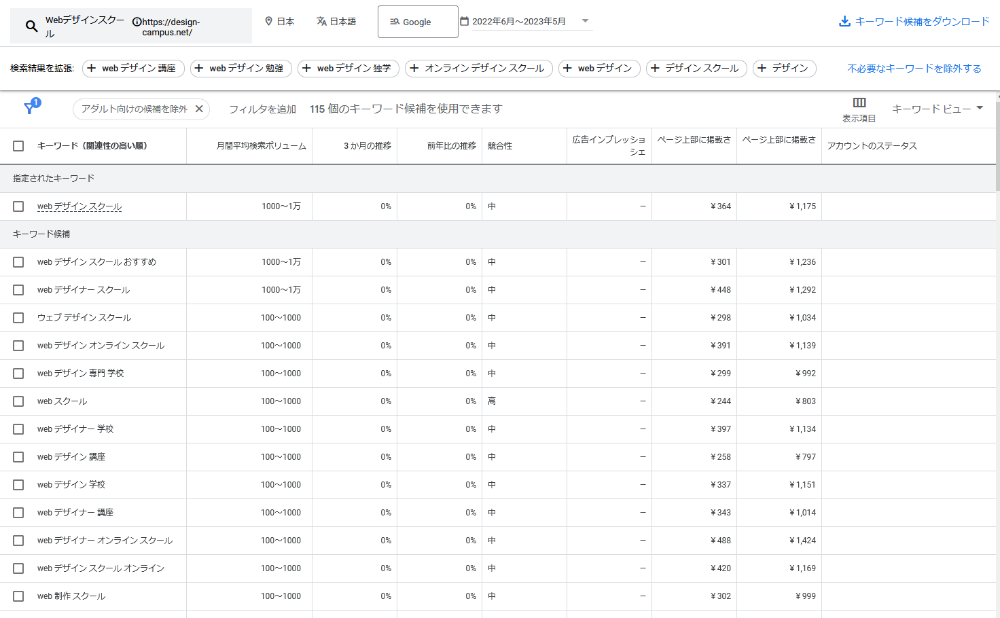

--

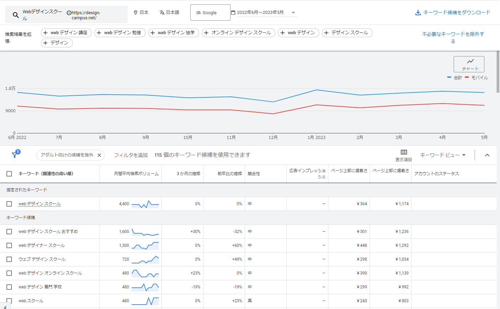

--

### 検索意図

--

需要のあるKWが分かった、けどもう一つ大事なことがある

--

どうして検索するのか、何が知りたくて検索するのか

--

これはこの次のコンテンツの話にもつながりますし、検索意図にマッチしたサイトはSEOで有利に働きます

--

考えるべきはユーザーのこと

--

ユーザーに焦点を絞れば、他のものはみな後からついてくる

--

[Google が掲げる 10 の事実 ](https://about.google/philosophy/)

--

### サイト制作時に最低限やっておくこと

--

モバイル対応

--

titleタグ
```
<title>八王子初のWebデザインスクール。対面でもオンラインでも学べます | DESIGN CAMPUS</title>
```
- 35文字程度(PCでは30程度)
- 重要なワードは前方に
- 入力した通りに表示されるとは限らない

--

meta name="desctiption"
```
<meta name="desctiption" content="DESINGN CAMPUSは、八王子初のWebデザイナー...">
```
- 50文字程度(PCでは120程度)
- ページの要約且つ魅力的で簡潔に
- 入力した通りに表示されるとは限らない

--

h1タグ
```
<h1>DESIGN CAMPUS</h1>
```
- 特に文字数の制限は考えなくてよい
- そのページを表す内容に
- 1ページに1つが望ましい
- h2以下も適切に

--

### 検索上位にしたい

--

ところでデザキャンて上位表示されてるの

--

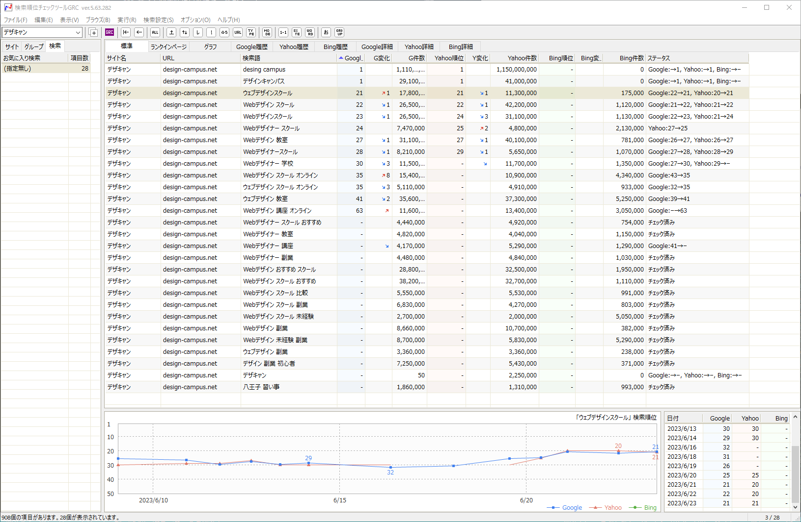

--

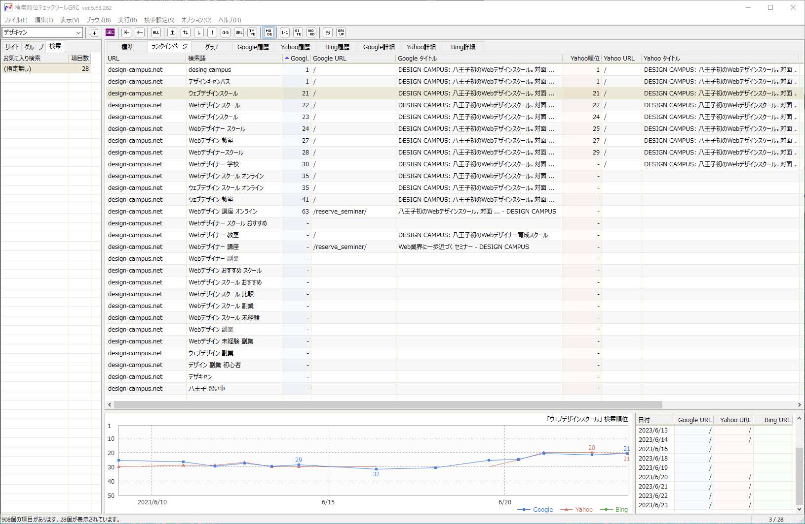

--

- 有益なコンテンツ
- リンク

--

### リンクの話

--

- 外部リンク
    * 被リンク(インバウンドリンク)
    * 発リンク(アウトバウンドリンク)
- 内部リンク

--

今はリンクはそんなに重要ではない、は本当か

--

その価値は下がっているが、いまだ重要。  
（但し今後はどんどん重要度は下がる）

--

#### SEOでリンクというと外部リンクの話がよく出るけども、内部も大事だよというお話

--

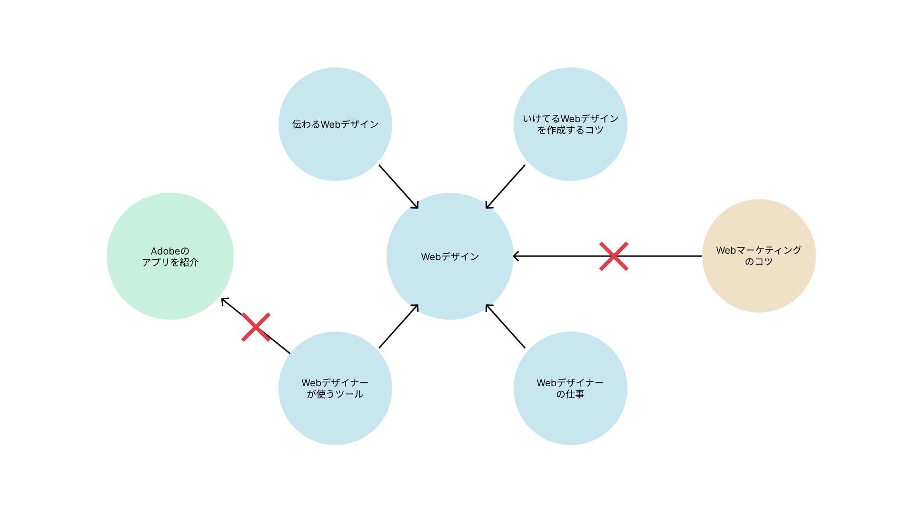


--

#### リンクのテキストが重要

✖
```
<a href="https://～">詳しくはこちら</a>
```

〇
```
<a href="https://～">Webデザインのコツ</a>
```

---

## 他にもある上位表示対策

--

ひじょーーーーに、多岐にわたります

--

### 参考1：コアウェブバイタル

--

- LCP（Largest Contentful Paint ）：読み込み時間
- FID（First Input Delay）：初回入力遅延(反応速度)
- CLS（Cumulative Layout Shift ）：ページの読み込み中に起こるレイアウトのずれ

--

FIDはINP(Interaction to Next Paint：ユーザーの操作に対する視覚的な反応)に変わります

※2024年3月～
--

### 参考2：LightHouseでチェック

--

<div class="separateBox">
<div style="flex: 0 0 50%">
    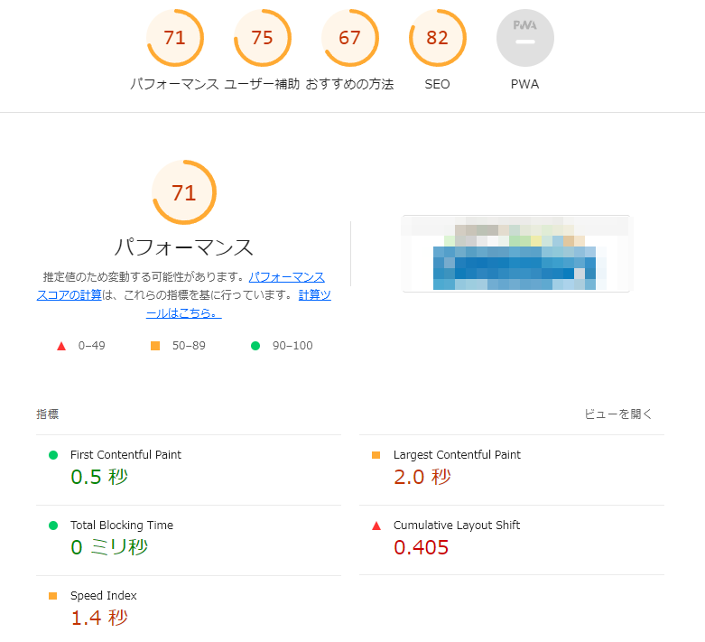
</div>
<div style="flex: 0 0 50%">
    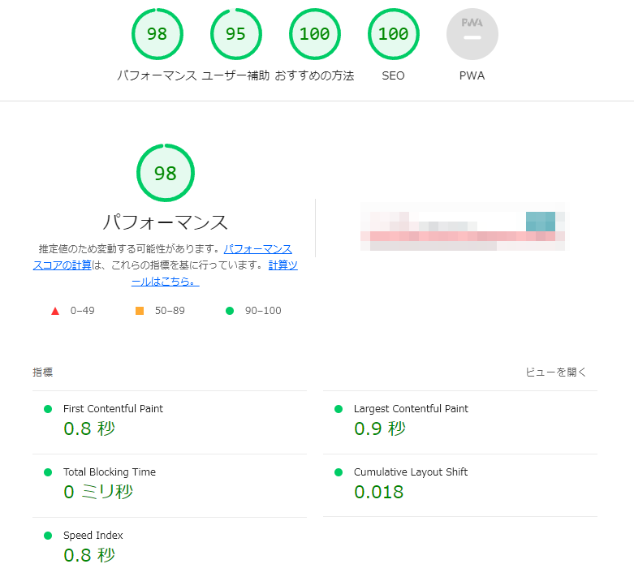
</div>

--

**他にも**

[PageSpeed Insights](https://pagespeed.web.dev/)

---

## コンテンツマーケティング

--

### 有益なコンテンツって

--

- 役に立つ: ユーザーが求めている情報が含まれている
- 品質: 内容が最新かつ正確なもの
- ビジュアル: 分かりやすい、美しいなど
- ユーザーを飽きさせない: 面白い、魅力的、使いやすい
- 共感性: ユーザーに共感してもらえる、共感しやすい
- 独自性: 他にはない独自のアプローチ、個性

--

#### E-E-A-T

- Experience（経験）
- Expertise（専門性）
- Authoritativeness（権威性）
- Trustworthiness（信頼性）

--

**参考**

[Google検索品質評価ガイドライン](https://static.googleusercontent.com/media/guidelines.raterhub.com/ja//searchqualityevaluatorguidelines.pdf)

--

**こっちも参考に**

[Think with Google](https://www.thinkwithgoogle.com/intl/ja-jp/)

---

## 来週に向けて

--

### 課題

--

#### 長尾さんへのプレゼンを考えてくる

- 全体的なコンセプト
- 来場1,000人のための仕掛け
- こだわった点
- デザイン上で表現できていない動きの部分などがあれば補足

etc...

--

#### もう一つ

--

自分のデザインしたものをコーディングする  
ここまでが前期の履修なので・・・  

--

これが終わっていないと残り3ヶ月を頑張っても卒業になりません

--

デザインは今日の段階までのものでかまいませんのでコーディングは卒業までに終わらせてください

--

コンペで選ばれたデザインは？

--

- 後期にデザイン専攻でブラッシュアップ  
- コーディング専攻がそれをもらってコーディング  

なので、自分の制作物とは別カウントになります

--

### 予告

と、いうことで来週は  
自分の制作物をPR！！  
コンペを勝ち抜いてください


